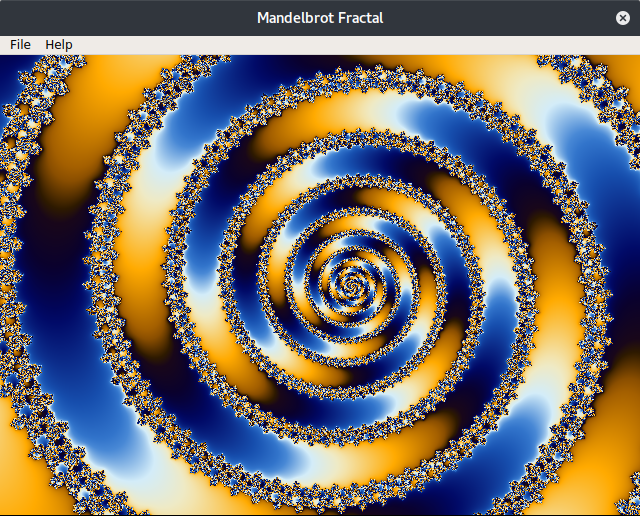

# Mandelbrot Viewer
### laboratory work for computer graphics course
 Here is a simple rendering program using optimized escape time algorithm with supersampling and linear interpolated colouring based on predefined palette. A seperate QThread used to render an QImage and signal it to a custom widget or other target. Rendering uses QtConcurrent framework to utilize all aviable CPU cores. Result can be exported to a file.
## Interface

## Rendering examples

