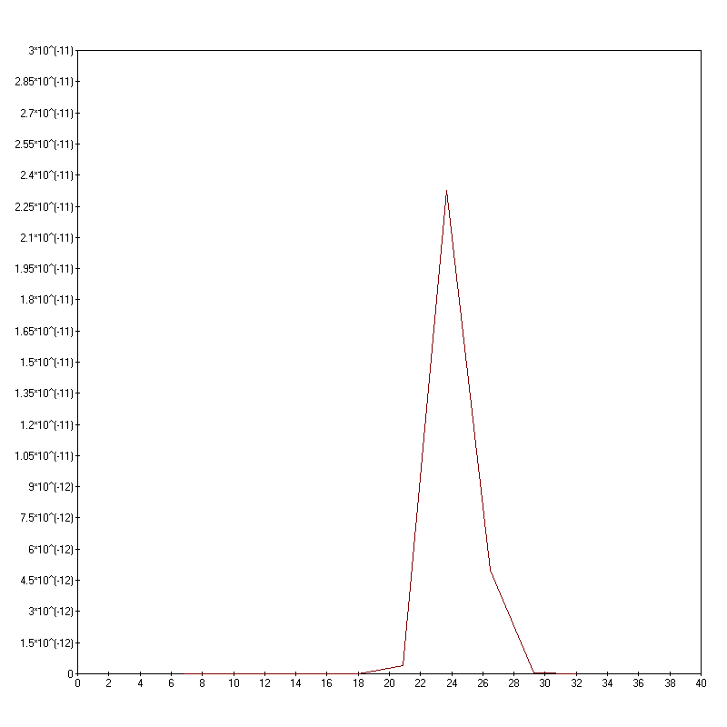

# lab1_cam
Function calculus.

## Results

```
Lab1 : CAM : Function calculus : cos(x) : [6.8 ; 34.9] :

:Test 1 : x=14.05

:eps                :n        :abs error          :rest
0.01                4         1.40048e-05         0.000582214
1e-05               6         2.84561e-09         2.37448e-07
1e-08               7         2.61504e-11         2.87176e-09
1e-11               9         1.51268e-15         1.8946e-13

:Test 2 : n=7

:x_i                :x_floored          :abs error          :rest
6.8                 0.516815            1.11022e-16         1.11245e-15
9.61                0.185222            1.11022e-16         6.41636e-22
12.42               0.146371            1.11022e-16         2.37655e-23
15.23               0.477963            3.33067e-16         3.7249e-16
18.04               0.809556            9.99201e-16         5.95727e-13
20.85               1.14115             3.92797e-13         7.28421e-11
23.66               1.47274             2.3244e-11          2.59037e-09
26.47               1.33726             4.97019e-12         6.70823e-10
29.28               1.00567             5.30687e-14         1.2415e-11
32.09               0.674073            7.77156e-16         4.58662e-14

Press ENTER...
```

