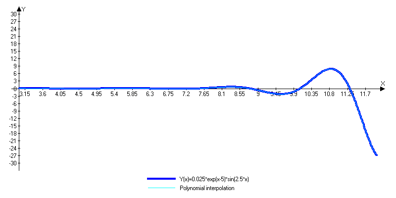

# Lab 5 : Polynomial interpolation
## Initial data
```
Function: 0.025*exp(x - 5)*sin(2.5*x);
Range = [3, 12]
Epsilon = 1e-2
```
## Test results
##### Program results
```
Calculating polynomial for test.csv...DONE
Recalculating n: 41; Error : 0.0408008
Recalculating n: 42; Error : 0.0925599
Recalculating n: 43; Error : 0.0423633
Recalculating n: 44; Error : 0.0427883
Recalculating n: 45; Error : 0.0433718
Recalculating n: 46; Error : 0.0599796
Recalculating n: 47; Error : 0.0902269
Recalculating n: 48; Error : 0.0836358
Recalculating n: 49; Error : 0.0784993
Recalculating n: 50; Error : 0.153405
Recalculating n: 51; Error : 0.18184
Recalculating n: 52; Error : 0.0561715
Recalculating n: 53; Error : 0.0555059
Recalculating n: 54; Error : 0.0845946
Recalculating n: 55; Error : 0.0326722
Recalculating n: 56; Error : 0.168243
Recalculating n: 57; Error : 0.044664
Recalculating n: 58; Error : 0.022061
Recalculating n: 59; Error : 0.0737605
Recalculating n: 60; Error : 0.0120079
Recalculating n: 61; Error : 0.0138952
Recalculating n: 62; Error : 0.0183628
Recalculating n: 63; Error : 0.0110933
Recalculating n: 64; Error : 0.547342
Recalculating n: 65; Error : 0.0118936
Recalculating n: 66; Error : 0.0304318
Recalculating n: 67; Error : 0.0106726
Recalculating n: 68; Error : 0.0231853
Recalculating n: 69; Error : 0.0234338
Recalculating n: 70; Error : 0.0234822
Recalculating n: 71; Error : 0.0548897
Recalculating n: 72; Error : 0.0468006
Recalculating n: 73; Error : 0.0390637
Recalculating n: 74; Error : 0.0354674
Recalculating n: 75; Error : 0.0162957
Recalculating n: 76; Error : 0.00650699
Resulting n: 76; Error : 0.00650699
Wrote 500   roots to test.csv...DONE
Press Enter...
```

##### Test graph
