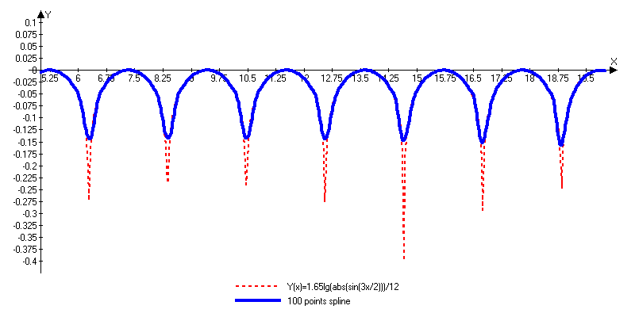
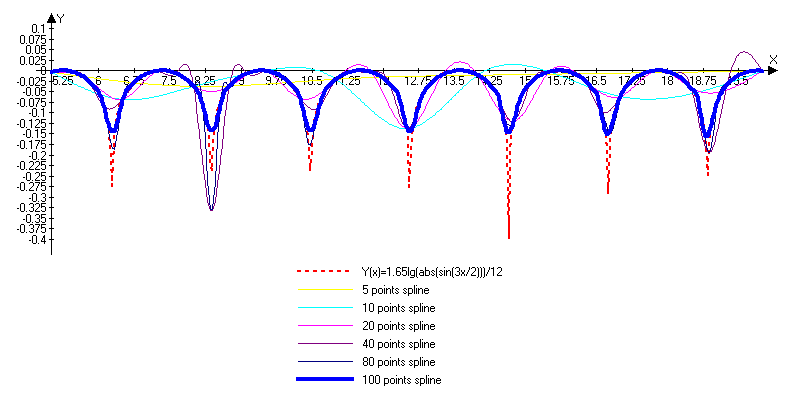

# Lab 6 : Cubic spline
## Initial data
```
Function: 1.65 * lg( |sin(3 * x / 2)| ) / 12;;
Range = [5, 20]
```
## Preamble

Cubic splines are widely used to interpolate over a set of data because of its simplicity.
Spline curve oscillates near the peak point which is the weak point of cubic method. 
Akima spline does not have this property but it is not covered by this laboratory work.

100 step spline has best precision over all of the graphs as you can see below.
## Test results
##### 100 steps


##### Multiple step ranges


You can find the test data in [Advanced Grapher file](tests/test_graph.agr).
